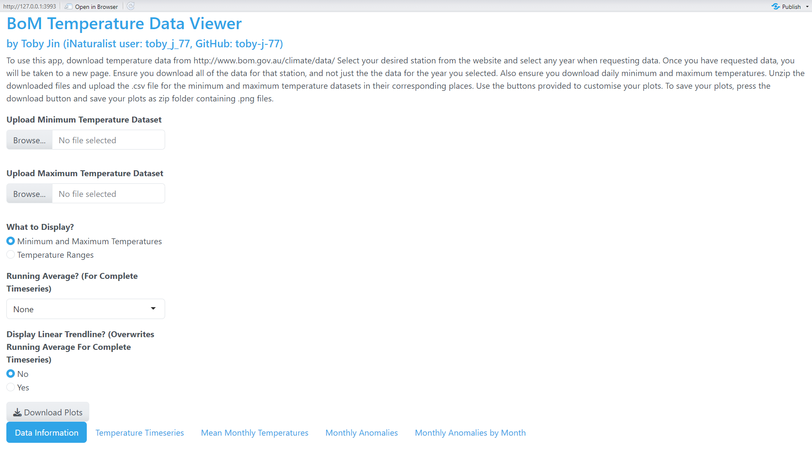

# BoM Temperature Viewer

The Bureau of Meteorology (BoM) Temperature Viewer App is a shiny based application that allows users to view and explore BoM temperature data for a particular station.

Users must input 2 .csv files from the station of interest in order for the app to work. These inputs must be of the minimum and maximum daily temperature measurements respectively. The app will check whether the inputs are from the same station, but it will not be able to check whether the files are uploaded to the correct place.

Once the correct files are uploaded, information about the data will be displayed under the tab **Data Information**. Here, the app returns information about the station number, the start and end dates of the data, the number of days this spans, the number of days where there is data, and what percent of days contains data. (Note: the app assumes that if a day contains minimum temperature readings, it will also contain maximum temperature readings, so the number of days with data is calculated from the number of days with minimum temperature readings only under this assumption).

## User inputs (excluding uploading files)

Apart from uploading files, the app has 3 other input features that the user can interact with to customise their plots:

### What to display?

This input has 2 options:

-   **Minimum and Maximum Temperatures**: This option allows users to create plots that show both the minimum and maximum temperatures recorded for a day/month.

-   **Temperature ranges:** This option allows users to create plots that show the temperature range on a certain day. The temperature range here is defined as the maximum temperature minus the minimum temperature for each day.

### Running Average? (For Complete Timeseries)

This input has 4 options, and they affect the plot **Temperature Timeseries** only:

-   **None**: No running average is applied and the raw data is displayed.

-   **7 days:** A 7 day running average is applied to the data and overlaid on the raw data.

-   **31 days:** A 31 day running average is applied to the data and overlaid on the raw data.

-   **365 days:** A 365 day running average is applied to the data and overlaid on the raw data.

When calculating running averages for datasets that contain large sections of no data, if the consecutive days with no data is equal to, or exceeds that of the running average length, then the running average will stop before the period of no data, and start again after the period of no data. If the number of consecutive days with no data is less than the running average length, missing values are linearly interpolated. (For more information on how this works, refer to the document split_fill_function.qmd under the App_planning folder.)

### Display Linear Trendline? (Overwrites Running Average For Complete Timeseries)

This input has 2 options, and affects **all plots except Mean Monthly Temperatures**. There are 2 options:

-   **No**: No trend is calculated for any plot, and the raw data is displayed (or the running average for **Temperature Timeseries** if the running average option is not set to none).

-   **Yes**: A linear trend is calculated for each of the affected plots, and a least squares regression line is plotted over the data. For **Temperature Timeseries**, this will remove any running average being displayed if the running average option is not set to none.

## Plots

This app produces a total of 4 plots

### Temperature Timeseries

.
