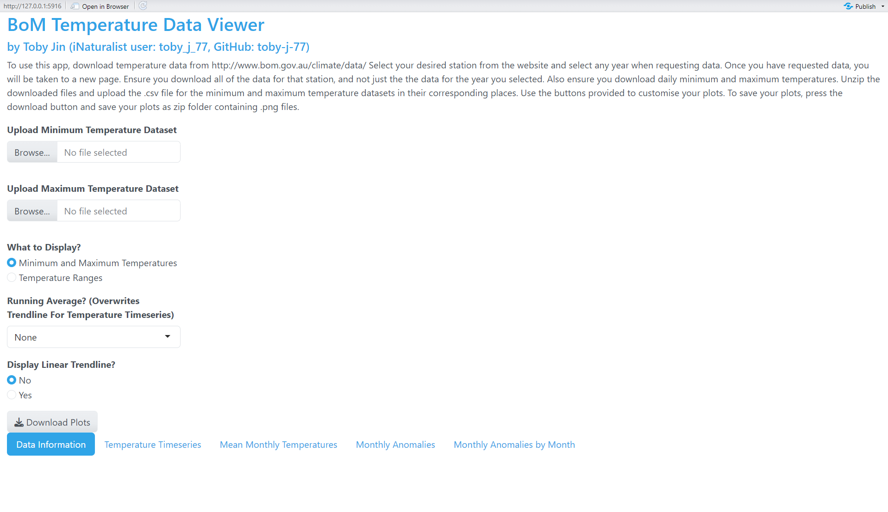
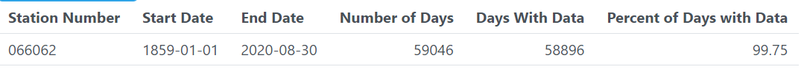
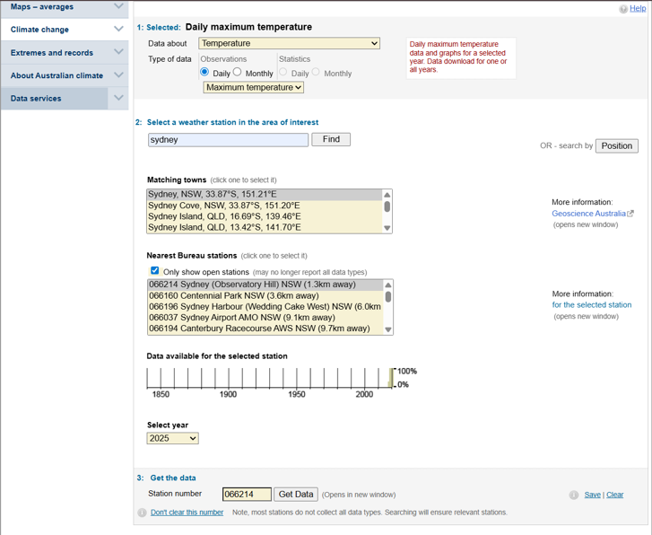
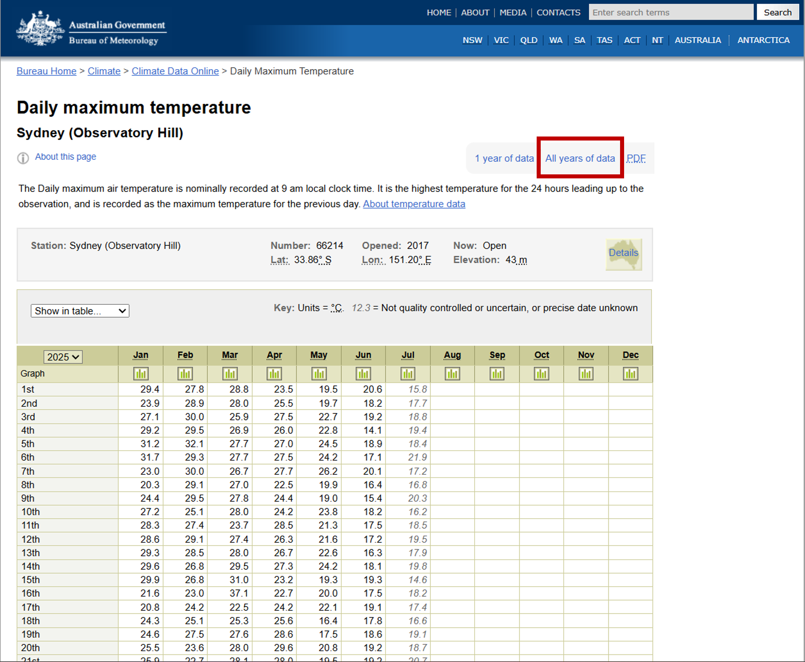
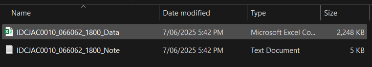
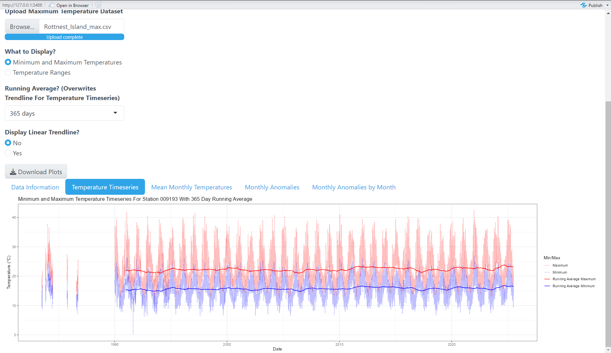
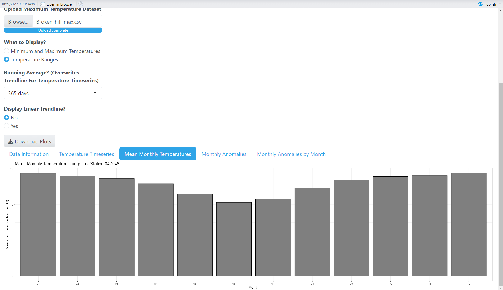
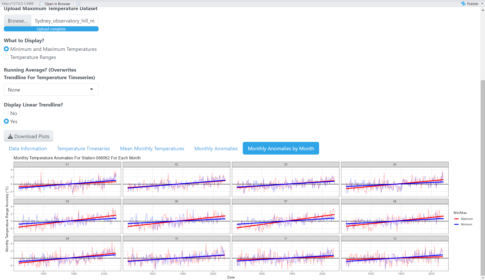

README
================
Toby Jin
2025-07-31

# BoM Temperature Viewer

The Bureau of Meteorology (BoM) Temperature Viewer App is a shiny based
application that allows users to view and explore BoM temperature data
for a particular station.

Users must input 2 .csv files from the station of interest in order for
the app to work. These inputs must be of the minimum and maximum daily
temperature measurements respectively. The app will check whether the
inputs are from the same station, but it will not be able to check
whether the files are uploaded to the correct place.

Once the correct files are uploaded, information about the data will be
displayed under the tab **Data Information**. Here, the app returns
information about the station number, the start and end dates of the
data, the number of days this spans, the number of days where there is
data, and what percent of days contains data. (Note: the app assumes
that if a day contains minimum temperature readings, it will also
contain maximum temperature readings, so the number of days with data is
calculated from the number of days with minimum temperature readings
only under this assumption).

## Using the app

As of currently, this app is not online and in order to use this app,
you must download the files **BoM_temperature_viewer.R**, and the folder
**R** along with its contents. Within the folder **Input_data**, there
are datasets that have been pre-downloaded and available to use.

## How to Download and Input BoM data

In order for the app to work, the user must input BoM data. In order to
download the correct data to input into this app, users must do the
following steps twice, one for downloading the minimum temperatures
dataset and one for downloading the maximum temperature dataset.

### Step 1: Accessing Data

Go to this website: <http://www.bom.gov.au/climate/data/> and follow the
instructions to get data from a desired station. Ensure that you are
downloading temperature data and have selected the option **Daily**. The
year input under select year does not matter, as long as you select a
year that actually contains data.

### Step 2: Downloading Data

Once you have pressed **Get Data**, you will be taken to a new window
that previews the data. Ensure that you press the button **All years of
data** (shown in the red box) to ensure you download all of the data
available from that station. This will result in a .zip file being
downloaded. Move that .zip file to somewhere appropriate on your
computer.

### Step 3: Extracting and uploading data

Once you have extracted the file, there will be 2 files, a text file and
a .csv file. The .csv file will contain the data you have downloaded in
long format. You should copy this file out and rename it so you can
remember whether it contains the minimum or maximum temperatures for
that station.

(Note, in the image above, I have not renamed the file yet).

## User inputs (excluding uploading files)

Apart from uploading files, the app has 3 other input features that the
user can interact with to customise their plots:

### What to display?

This input has 2 options:

- **Minimum and Maximum Temperatures**: This option allows users to
  create plots that show both the minimum and maximum temperatures
  recorded for a day/month.

- **Temperature Ranges:** This option allows users to create plots that
  show the temperature range on a certain day. The temperature range
  here is defined as the maximum temperature minus the minimum
  temperature for each day.

### Running Average?

This input has 4 options, and they affect the plot **Temperature
Timeseries** only (note, if a running average is chosen, then no
trendline will be displayed for **Temperature Timeseries** when the
option **Yes** is selected for **Display Linear Trendline?**):

- **None**: No running average is applied and the raw data is displayed.

- **7 days:** A 7 day running average is applied to the data and
  overlaid on the raw data.

- **31 days:** A 31 day running average is applied to the data and
  overlaid on the raw data.

- **365 days:** A 365 day running average is applied to the data and
  overlaid on the raw data.

When calculating running averages for datasets that contain large
sections of no data, if the consecutive days with no data is equal to,
or exceeds that of the running average length, then the running average
will stop before the period of no data, and start again after the period
of no data. If the number of consecutive days with no data is less than
the running average length, missing values are linearly interpolated.
(For more information on how this works, refer to the document
**split_fill_function.qmd** under the **App_planning** folder.)

This

### Display Linear Trendline?

This input has 2 options, and affects **all plots except Mean Monthly
Temperatures**. There are 2 options:

- **No**: No trend is calculated for any plot, and the raw data is
  displayed (or the running average for **Temperature Timeseries** if
  the running average option is not set to none).

- **Yes**: A linear trend is calculated for each of the affected plots,
  and a least squares regression line is plotted over the data. For
  **Temperature Timeseries**, no trendline will be displayed if the
  option for **Running Average?** Is set to a value other than **None**.

## Plots

This app can display a total of 4 plots, although once you have uploaded
the correct datasets, a total of 8 plots will be created. This is
because there are 4 plots that relate to minimum and maximum
temperatures, and 4 plots that relate to temperature ranges. Depending
on the input in **What to display?**, either the min/max plots or the
temperature range plots will be shown.

### Temperature Timeseries

This plot graphs the daily temperature across time. If the option
**Minimum and Maximum Temperatures** are selected, the timeseries will
contain 2 lines, with the red line representing maximum daily
temperature and the blue line representing minimum daily temperature. If
the option **Temperature Ranges** is selected, then a single line
showing the daily temperature range will be displayed instead.

### Mean Monthly Temperatures

This plot shows the mean temperatures for each of the 12 months in the
year.

If the option **Minimum and Maximum Temperatures** is selected, then the
resulting plot is a clustered barchart with each month showing 2 bars.
The red bar represents the mean maximum temperature and the blue bar
represents the mean minimum temperature. These monthly means are
calculated by calculating the mean across all days for that month across
all years in the dataset.

If the option **Temperature Ranges** is selected, then a barchart with a
single bar for each month is displayed. The height of the bar represents
the average temperature range for that month by calculating the mean
temperature range across all days of that month for all years in the
dataset.

### Monthly Anomalies

This plot shows a timeseries of monthly anomalies calculated using the
input temperature data.

If the option **Minimum and Maximum Temperatures** is selected, then
there are 2 lines in the timeseries. The red line represents the monthly
anomaly of maximum temperatures, and the blue line represents the
monthly anomaly of minimum temperatures. The monthly anomaly for minimum
temperatures in a given month for a given year is calculated by
subtracting the mean minimum temperature for that month across all years
from the mean minimum temperature for that month on a specific year. The
same approach is used to calculate maximum monthly anomalies. (For more
information, refer to **Chart_creation.qmd** in the **App_planning**
folder).

If the option **Temperature Ranges** is selected, then a single line is
displayed for the timeseries. This black line represents the temperature
range anomaly for that year. The temperature range anomaly is calculated
using the same method as the min/max temperature anomalies. The mean
temperature range for a month across all years is subtracted from the
mean temperature range for that month in each given year (For more
information, refer to **Chart_creation.qmd** in the **App_planning**
folder).

### Monthly Anomalies by Month

This plot shows the same information as the **Monthly Anomalies** plot,
except that it shows the timeseries of anomalies for each month
individually. This is done using the facet_wrap() function in *ggplot2.*

## Downloading plots

Once the user generates their desired plots, they are able to download
plots using the **Download Plots** button. Due to the size of some of
the datasets and plots, it may take a few seconds to respond. Once
prompted, the app will save the user’s plots in a zip file called
**plots.zip** where each plot is saved as a .png file. Only the current
plots shown by the user will be downloaded.

## Suggested Usage

This app provides a quick and easy way to plot and visualise BoM data,
but does not clean or perform any analysis on the data. The plots
generated in this app are user friendly and can be used in a wide range
of scenarios from teaching to exploring temperature patterns in a
desired region. Below are 3 examples on how the app can be used.

### Example 1: Running average of Rottnest Island Temperatures

This example shows how you can use this app to view an annual running
average of minimum and maximum temperatures recorded by station 009193
on Rottnest Island.

### Example 2: Monthly Temperature Ranges at Broken Hill

This example shows how this app can be used to investigate which month
shows the highest mean daily difference between the minimum and maximum
temperatures for station 047048 in Broken Hill.

### Example 3: Monthly Temperature Trends

This example shows how this app can be used to investigate how
temperature trends differ between each month in station 066062 in Sydney

## Creating the app

This section goes into more technical detail on how the app was created.

### Required R version and R Packages

This app was build in R version 4.4.2. The packages required to run this
app are *bslib* v.0.7.0, *forecast* v.8.24.0, *RColorBrewer* v1.1-3,
*shiny* v. 1.10.0, *tidyverse* v.2.0.0, and *zip* v. 2.3.3. (Any other
packages in which these packages depend on should also be installed).

### Creating plots

Prior to creating the app, code for binding data and creating the
required plots have been written to create the plots for a single pair
of datasets. This code can be found in the document
**Chart_creation.qmd** in the **App_planning** folder.

### Custom functions

There are two custom functions used to process the data, with each
function being stored in a separate .R file in the folder **R**.

- **month_middle(DATE)** This function is stored in the file
  **month_middle_2.R.** This month takes a date as an input, and
  calculates the date for the middle of the month of that date.

- **split_fill(x, na_length = 5, ra_length = 3)** This function takes a
  column from a dataframe and calculates the running average for each
  chunk of data for that column. A chunk of data is defined as a series
  of rows which do not contain consecutive NAs that exceed the length
  na_length (which has a default value of 5). For each chunk of data,
  the running average is calculated with a length of ra_length (which
  has a default value of 3). This function means that when calculating
  running averages, if there are large sections with no data, the
  running average doe snot simply ‘jump’ across a section of no data,
  but restarts when the next section of data is found. This is the only
  function where AI assistence has been used (see the document
  **split_fill_function.qmd** under the **App_planning** folder.).

### Creating the app

This app was created using the R package *shiny* v1.10.0. The app was
incrementally developed by adapting code from **Chart_creation.qmd**
into code that would be applied to reactive shiny objects. No AI was
used in the creation of the app. Plots were sequentially added in the
order they appear in at the bottom of the app. Additional input features
were added only after all plots have been created.

### AI

The only instance where AI has been used is in the creation of the
function split_fill, where its use has been documented. Microsoft
Copilot was used to ensure that the function split_fill() was compatible
with the mutate() function. No other instances of AI has been used in
the creation of this app.

## Acknowledgements

I would like to acknowledge Associate Professor Alex Sen Gupta (UNSW)
for providing feedback on what features and improvements should be made
to the app. I would also like to acknowledge Dr Ben Walker (UNSW) for
assisting in troubleshooting the download button for this web app during
the UNSW CodeRs help session on 24/07/2025.
